# PSET2 
---
> Segue a baixo, lista de respostas de acordo com as questões determinadas no PSET 2 pelo professor Abrantes.

## Questão 1
Resposta: 
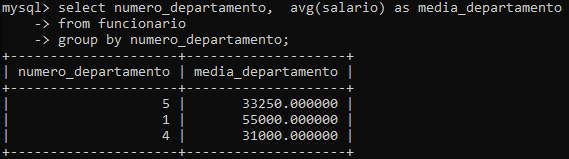

## Questão 2
Resposta: 
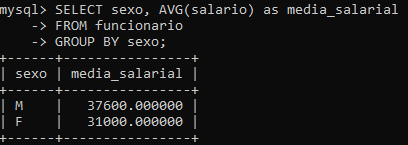

## Questão 3
Resposta: 
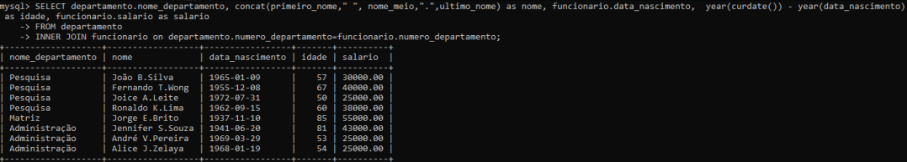

## Questão 4
Resposta: 
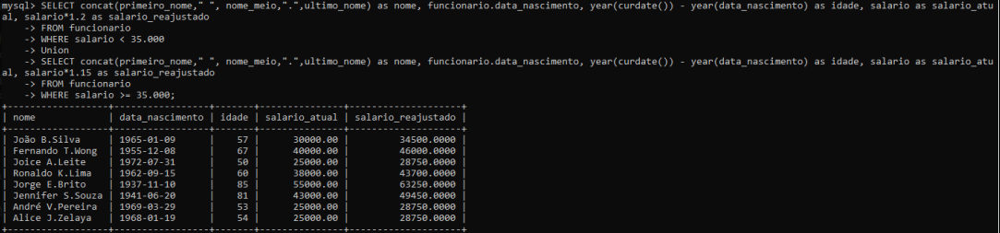

## Questão 5
Resposta: 
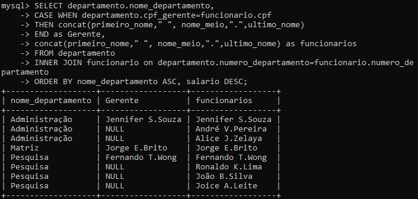

## Questão 6
Resposta: 
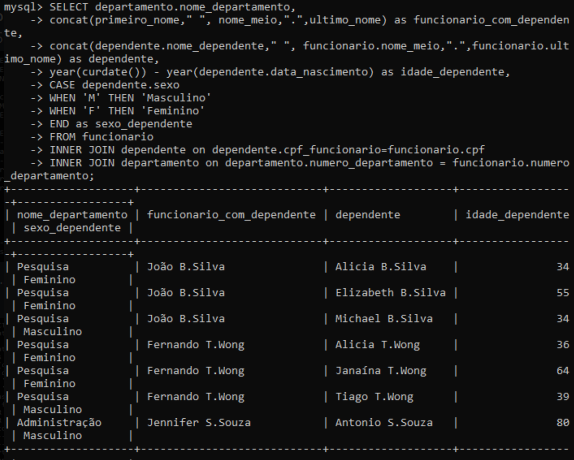

## Questão 7
Resposta: 
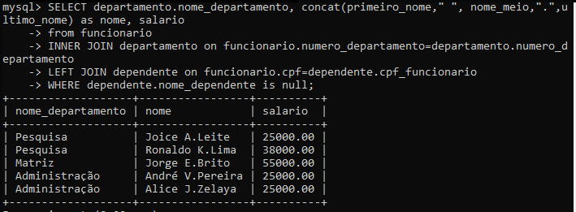

## Questão 8
Resposta: 
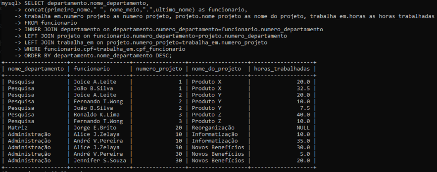

## Questão 9
Resposta: 
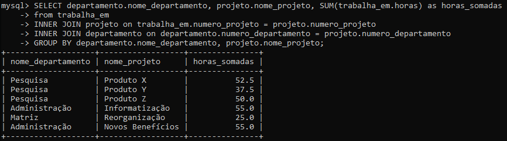

## Questão 10
Resposta: 
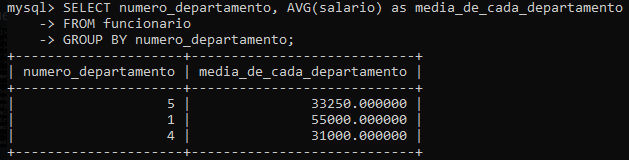

## Questão 11
Resposta: 
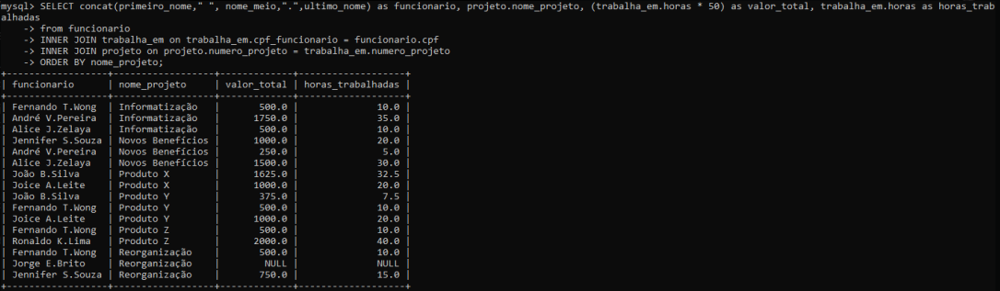

## Questão 12
Resposta: 
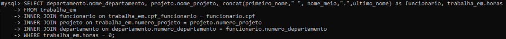

## Questão 13
Resposta: 
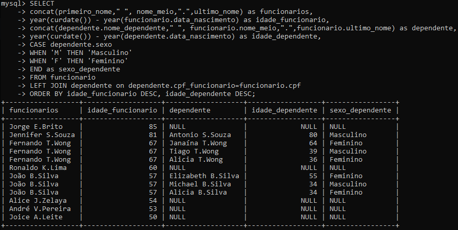

## Questão 14
Resposta: 
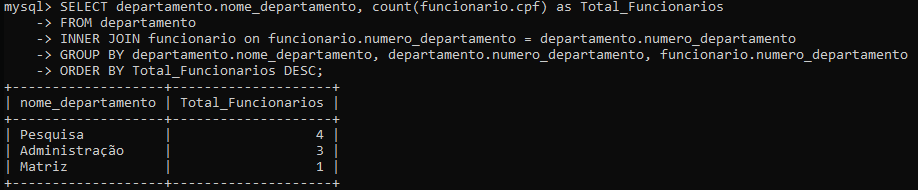

## Questão 15
Resposta: 
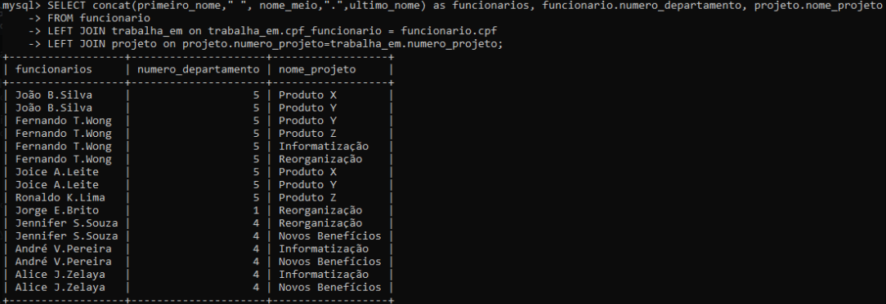
